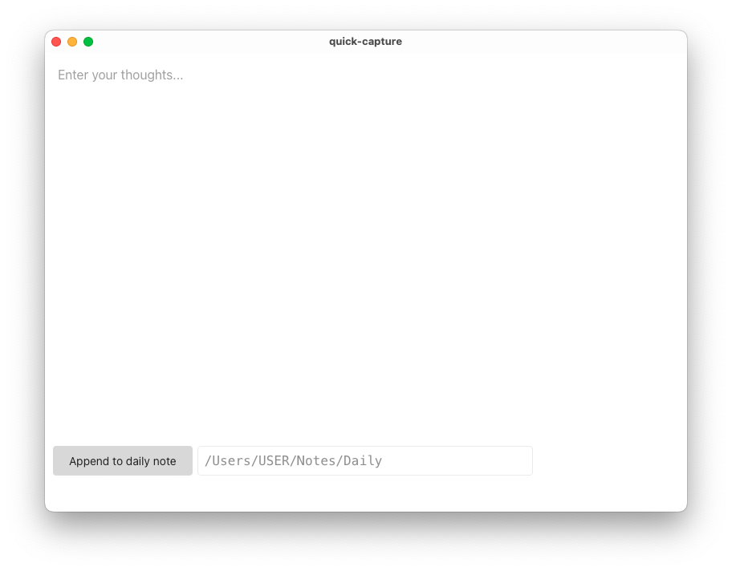
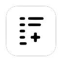

# Quick Capture to Daily Note

A quick capture app (written in Tauri) to add thoughts to your daily note.  
It has a plain multiline textarea where you can add your thought.  
You set the path to your daily notes via an input field.

This will append the given thought to a daily note.  
If no daily note is present, it will also create the note first.
If intermediate folders don't exist, it will create the folders.

It's meant for Markdown text input.

It only works with daily notes in the `YYYY-MM-DD.md` format for now.  
Every thought is added in the following format: _H2 Timestamp > Text > Newline_

**Usage**  
Copy binary to applications and double-click.  
Set path to where your daily notes live.  
Write your thought and submit via button click.  
You can also submit via `cmd+enter` (Mac)/`ctrl+enter` (Windows)  
Your input is automatically saved as a draft while you type (updates on pause).  
Drafts are restored when you reopen the app.  
Speed up app launching with with an app like Alfred or Raycast and hotkeys.

**Formatting Shortcuts**  
The app supports the following formatting shortcuts:
- Bold: `cmd+b` (Mac) / `ctrl+b` (Windows)
- Italic: `cmd+i` (Mac) / `ctrl+i` (Windows)
- Link: `cmd+k` (Mac) / `ctrl+k` (Windows)
- Todo: `cmd+l` (Mac) / `ctrl+l` (Windows)
- Increase Font Size: `cmd++` (Mac) / `ctrl++` (Windows)
- Decrease Font Size: `cmd+-` (Mac) / `ctrl+-` (Windows)

Note: These shortcuts add formatting to the selected text or at the cursor position.
They do not toggle formatting; applying a shortcut multiple times adds multiple formatting marks.

Examples:
- Selecting text and using the bold shortcut will wrap it with `**`: `**selected text**`
- Using the italic shortcut will add `*` around the selection or at the cursor: `*text*`
- The link shortcut will create a Markdown link structure: `[selected text](|)` or `` if no text is selected.  
- The `|` indicates where the cursor will be placed after hitting the shortcut

**Screenshot**  

**Icon**
The app has an icon as well

**Caveats**  
Only tested on MacOS 12.7 (x64) and 14.3 (Silicon)  
Works only with absolute paths, `~` not supported  
Will not get flexible ([#18](https://github.com/minthemiddle/Quick-Capture/issues/18))  
Will not get a WYSIWYG editor ([#18](https://github.com/minthemiddle/Quick-Capture/issues/18))  
Will not get tag autocompletion ([#19](https://github.com/minthemiddle/Quick-Capture/issues/19))  
Will not get a flexible save format (anytime soon) ([#17](https://github.com/minthemiddle/Quick-Capture/issues/17))

**Build**  
To build the app yourself, make sure that _rust_ and _npm_ are installed.  
`cargo install tauri-cli`  
`cd src-tauri`  
`cargo tauri build`  
Find the builds in the `/target` folder.
